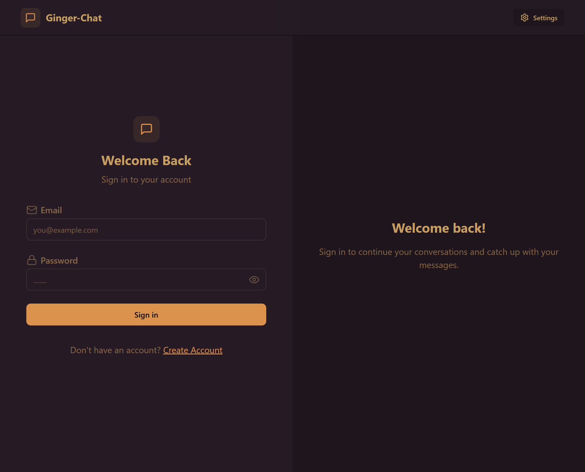
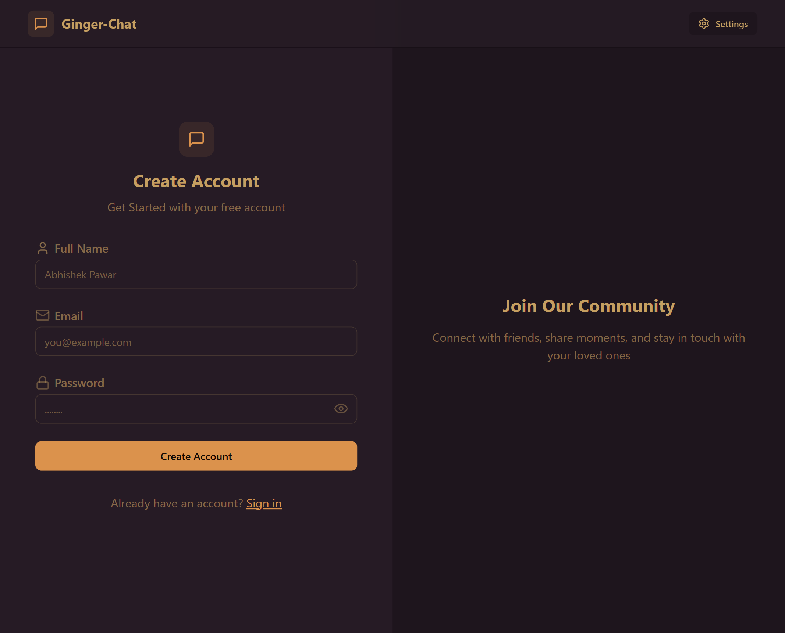
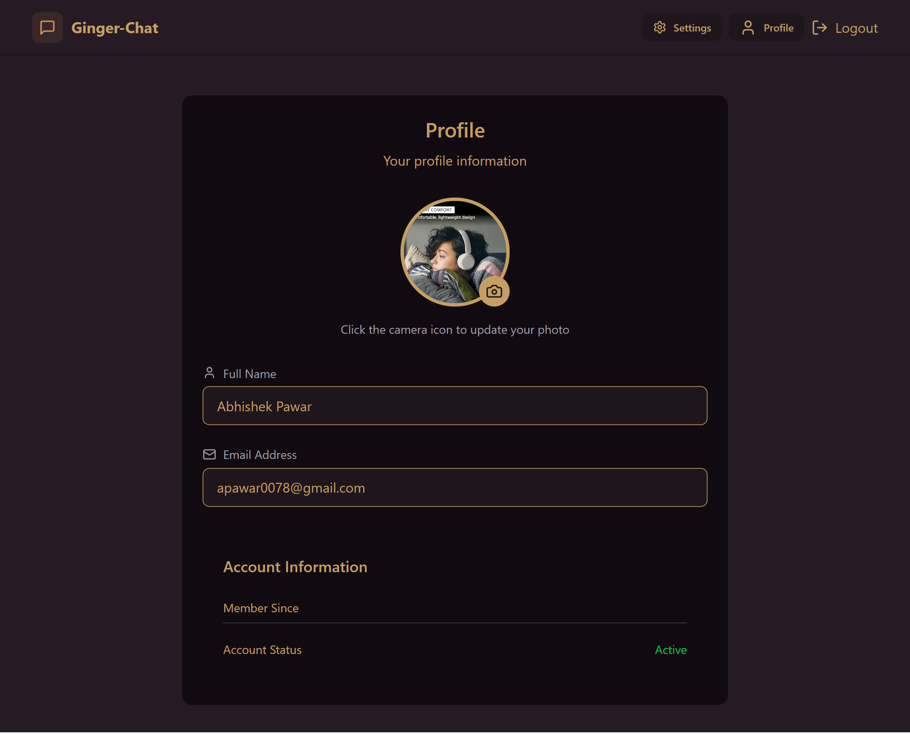
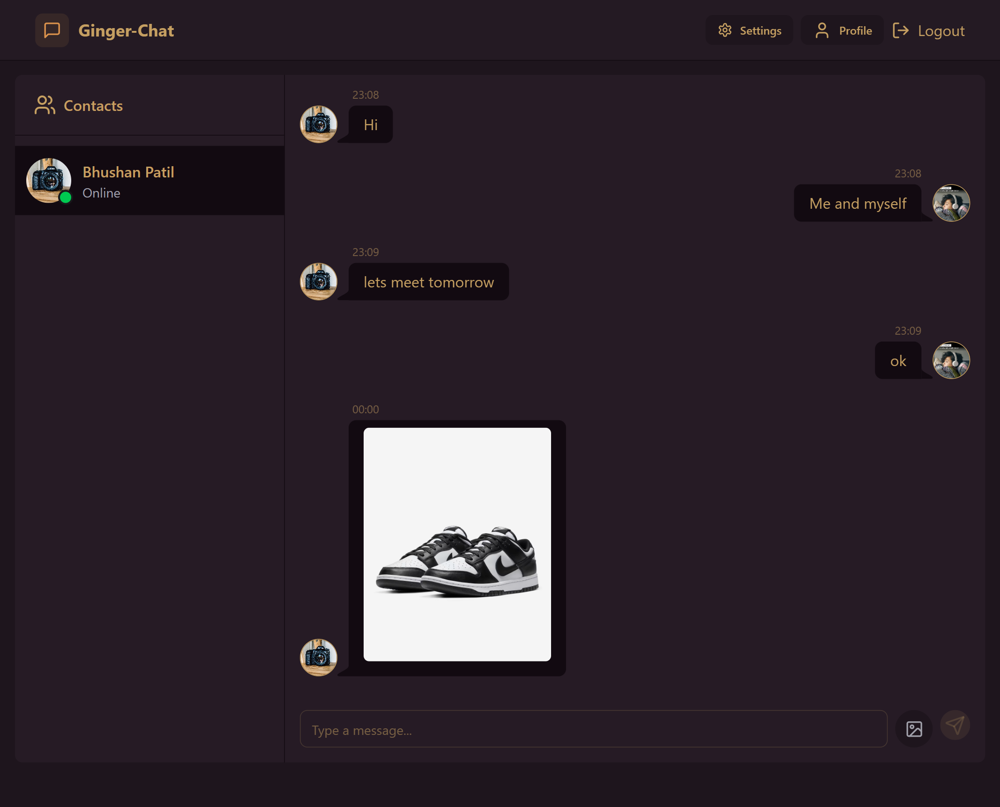
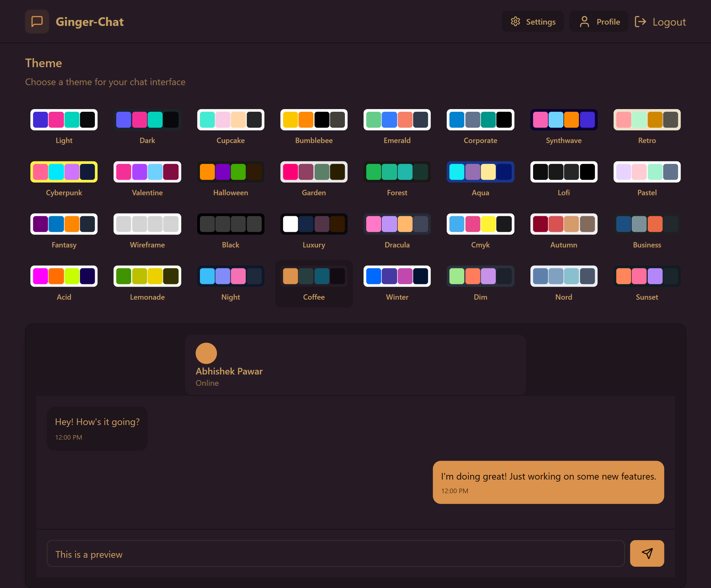

## Ginger Realtime Chat App

Developed a full-stack real-time chat application. Built using the MERN stack, with JWT authentication and Socket.IO for instant messaging.

### 🚩 Live Demo

Current version running at: [https://gingle-chat-1.onrender.com/](https://gingle-chat-1.onrender.com/)

> [!NOTE]
> It may take up to 1 minute for the site to be brought up while the loading indicator is displayed, since free instances in Render will spin down with inactivity which can delay requests by 50 seconds or more.

### ✨ Features

- Theme Selection
- signing up & signing in
- setting up your profile info when signing in for the first time
- updating your profile info
- real-time chatting with your friends in direct messages
- sending images and other files in chats


### ⚙ Setup

- ### create a `.env` file in the `server` folder

```
PORT=5001
JWT_KEY="YOUR_JWT_KEY"
DATABASE_URL="YOUR_DATABASE_URL"

CLOUDINARY_CLOUD_NAME = CLOUD_NAME
CLOUDINARY_API_KEY = CLOUD_API_KEY
CLOUDINARY_API_SECRET = CLOUD_API_SECRET
```

### 🏃‍♂️ Running in local development mode

- `server`

```bash
cd server
npm install
npm run dev
```

- `client`

```bash
cd client
npm install
npm run dev
```

<h2>Project screenshots</h2>

<h3>Login page</h3>



<h3>Create Account page</h3>



<h3>Profile page</h3>



<h3>Chat page</h3>



<h3>Theme page</h3>


